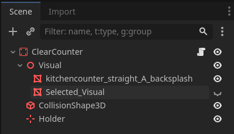

# Kitchen Chaos
## Objective:
My objective is to follow the [curse](https://www.youtube.com/watch?v=AmGSEH7QcDg&t=4960s) made by [Codemonkey](https://www.youtube.com/@CodeMonkeyUnity) to learn how to create a "professional" game.

**I will not be using Unity like Codemonkey**, instead **I will use Godot 4.4.1**. I will do my best to translate from Unity to Godot. This ReadMe will work as a type of ***journal***.

Another important note is that I will be using **GDscript** and not **C#**, although it is possible to use C# in Godot. I have chosen to use GDscript for personal reasons.

## Index: 

* [Post processing](#post-processing)
* [Player](#player)
* [Animations](#animations)
* [Cinemachine](#cinemachine)
* [Refractor](#refractor)
* [Collision](#collision)
* [Clear Counter](#clear-counter)
	* [Interactions](#interactions)
	* [Selected Visual](#selected-visual)
* [Resources](#resources)
* [Player pick up](#player-pick-up)

## Preparation:
The preparations consisted of:
1) Creating the Godot project
2) Configuring VSCode
3) Configuring GitHub

Unfortunately, the curse does not have a section for GitHub.

## Assets:
The assets provided by Code Monkey were not used in this project. Instead, the **[KayKit : Restaurant Bits](https://kaylousberg.itch.io/restaurant-bits)** asset pack created by **[Kay Lousberg](https://kaylousberg.itch.io/)** was used as a substitute.

# Post processing 

## Settings used in the curse:
### Unity settings:
	* Tonemapping: Neutral
	* Contrast: 20
	* Saturation: 20
	* Bloom Threshold: 0.95
	* Bloom Intensity: 1
	* Vignette Intensity: 0.25
	* Vignette Smoothness: 0.4
	* Anti-aliasing (MSAA): 8x
	* Screen space ambient occlusion (SSAO): 
		+ Intensity: 4
		+ Radius: 0.3
		+ Falloff distance: 100
		+ Direct lighting distance: 1
### Godot settings:
	* Tonemapping: Filmic
	* Contrast: 1.2
	* Saturation: 1.2
	* Bloom: 0.95
	* Blend mode: mix
	* Anti-aliasing (MSAA): 8x
	* Screen space ambient occlusion (SSAO): 
		+ Intensity: 4
		+ Radius: 0.3

To note, Godot does not have a vignette by default.

## Camera settings:
### Unity settings:
	* Position: 0, 21.5, -21.3
	* Rotation: 46, 0, 0
	* Fov: 20
### Godot settings: 
	* Position: 0, 21.5, 21.3
	* Rotation: -46, 0, 0
	* Fov: 20

# Player: 

Thanks to Godot's node structure, maintaining the separation between a player's logic and visual elements is straightforward.

I've recreated the look of the player using simple spheres 

## Player movement: 
Implementing player movement in Godot was straightforward.
All that was needed was to toggle jumping and gravity from the template.
Unfortunately, there is no obfuscation in GDScript (to my knowledge)

# Animations: 
I used `Animation Player` to create the *Idle* and *Walk* animations, playing them based on the condition:

	@export var player: Player
	@export var animation_player: AnimationPlayer

	func _process(_delta):
		if player.velocity.x != 0 || player.velocity.z != 0:
			animation_player.play("Walk")
		else:
			animation_player.play("Idle")

What wasn't straightforward was rotating the player.
In Unity, all Codemonkey needed to do was:
	
	float rotateSpeed = 10;
	transform.foward = Vector3.lerp(transform.foward, moveDir, Time.deltaTime * rotateSpeed);

With a lot of trial and error i replicate the effect with: 

	if direction:
		var rotate_speed : float = 10
		var target_basis := Basis(Vector3(0, 1, 0), atan2(direction.x, direction.z))
		set_basis(basis.slerp(target_basis, rotate_speed * delta))

# Cinemachine: 
In this section, CodeMonkey showcases Cinemachine, which is the equivalent of Godot's **Phantom Camera**. However, I will skip this section regardless.

# Refractor: 

Although there is no *NewInputSystem* in Godot, I still created a **GameInput** node and refractored the input

	extends Node
	class_name GameInput

	func get_player_movement_vector() -> Vector2:
		return Vector2(Input.get_vector("Move_Left", "Move_Right", "Move_Up", "Move_Down"))

# Collision: 

`CharacterBody3d` handles collion on it's own, skip

# Clear counter: 

To enable collisions, I had to use a `StaticBody3D` as the parent node.

## Interactions: 

Godot has by default an `raycast3D` node

I verify that the raycast collides with the correct object by checking the object's class:

	func _handle_interaction() -> void:
		if interaction_ray.get_collider() is Counter:
			set_selected_counter(interaction_ray.get_collider())
		else :
			set_selected_counter(null)

Created an input for the interaction:

In GameInput, I've created a **signal** named "interact" and emit it when the player provides the input.

	extends Node
	class_name GameInput

	signal interact

	func _unhandled_key_input(event: InputEvent) -> void:
		if event.is_action_pressed("Interact"):
			emit_signal("interact")

the player listens to the `signal` and calls the appropiate function

	func _ready() -> void:
		gameInput.interact.connect(handle_interaction)

	func handle_interaction() -> void:
		if selected_counter:
			selected_counter.interact()

## Selected visual: 

In Godot, the equivalent of the **Singleton pattern** is the **Autoload** system.
I created the Autoload "GameManager", which is a script that is always active and can be accessed by every other script.

	signal selected_counter_changed

	var selected_counter: Counter

	func set_selected_counter(new_selected_counter: Counter) -> void:
		selected_counter = new_selected_counter
		selected_counter_changed.emit()

The player invokes the function whenever the selected counter is updated:

	GameManager.set_selected_counter(selected_counter)

The script managing the visual listens:

	@export var counter: Counter
	@export var selected_visual: MeshInstance3D

	func _ready() -> void:
		selected_visual.visible = false
		GameManager.selected_counter_changed.connect(on_selected_counter_changed)

	func on_selected_counter_changed() -> void:
		selected_visual.visible = counter == GameManager.selected_counter

# Resources

**Scriptable Objects** are a Unity concept, but the idea can be adapted to Godot (with a few quirks).

Resources are reusable, savable containers of values, separated from scenes and nodes.
They provide a way to:
- easily share and modify data
- avoid duplication
- decouple values between logic and instances

This makes the code easier to read and maintain, as it clearly states the benefits of using Resources.

To create a scriptable object, also known as a **Resource** in Godot, create a script:

	extends Resource
	class_name KitchenObjectSO

	@export var name: String
	@export var scene: PackedScene

# Player pick up (And Interfaces): 

This section was the most challenging part of the course for me. The transitions between what the player, the counter, and the kitchen object (a new script, not the resource) should do were too abrupt.

Additionally, GDscript doesn't natively support interfaces.

Therefore, I devised a different solution that suits **me** better, though it might vary in clarity for others. Nonetheless, it accomplishes the objectives of this part of the course.

Here's what I did:

1) Set up a `Marker3D` node as the player's hand to hold kitchen objects.
2) Keep track of the kitchen object currently held by the player.
3) Create a dedicated script for `KitchenObject` with utility functions:

		extends Node3D
		class_name KitchenObject

		func change_holder(new_parent: Node3D):
			get_parent().remove_child(self)
			new_parent.add_child(self)
			global_transform.origin = new_parent.global_transform.origin

4) Centralize the interaction logic by having the player pass itself to the counter, allowing for:

		func interact(player: Player) -> void:
			if !ingridient_instance and !player.held_kitchen_object:
				print("spawn ingridient")
				ingridient_instance = ingridient.scene.instantiate()
				add_child(ingridient_instance)
				ingridient_instance.global_transform.origin = top.global_transform.origin
			
			elif ingridient_instance and !player.held_kitchen_object:
				print("give ingridient")
				player.held_kitchen_object = give_kitchen_object()
				player.held_kitchen_object.change_holder(player.hand)

			elif !ingridient_instance and player.held_kitchen_object:
				print("take ingridient")
				ingridient_instance = player.held_kitchen_object
				player.held_kitchen_object = null
				ingridient_instance.change_holder(self)

5) The player only calls the counter function, which is delegated the interaction logic, keeping the code organized and easy to follow.

# Counters

I developed scripts for "ClearCounter" and "CrateCounter," both of which extend the functionality of the base class Counter:

	extends Node3D
	class_name Counter

	@export var counterName: String = "Counter"
	@export var top: Marker3D

	var ingridient_instance: KitchenObject

	func interact(_player: Player) -> void:
		print("I forgot something");

	func give_kitchen_object() -> KitchenObject:
		var obj = ingridient_instance
		ingridient_instance = null
		return obj

## ClearCounter: 

	extends Counter
	class_name ClearCounter

	func interact(player: Player) -> void:
		if ingridient_instance and !player.held_kitchen_object:
			print("give ingridient")
			player.held_kitchen_object = give_kitchen_object()
			player.held_kitchen_object.change_holder(player.hand)

		elif !ingridient_instance and player.held_kitchen_object:
			print("take ingridient")
			ingridient_instance = player.held_kitchen_object
			player.held_kitchen_object = null
			ingridient_instance.change_holder(top)

## CrateCounter: 

	extends Counter
	class_name CrateCounter

	@export var ingridient: KitchenObjectSO

	func interact(player: Player) -> void:
		if !ingridient_instance and !player.held_kitchen_object:
			print("spawn ingridient & gives it")
			ingridient_instance = ingridient.scene.instantiate()
			add_child(ingridient_instance)

			player.held_kitchen_object = give_kitchen_object()
			player.held_kitchen_object.change_holder(player.hand)

Using inheritance, I only need to implement the specific logic for the Counter.
Creating a new type of counter involves only updating the visual and creating the specific script that extends Counter.

